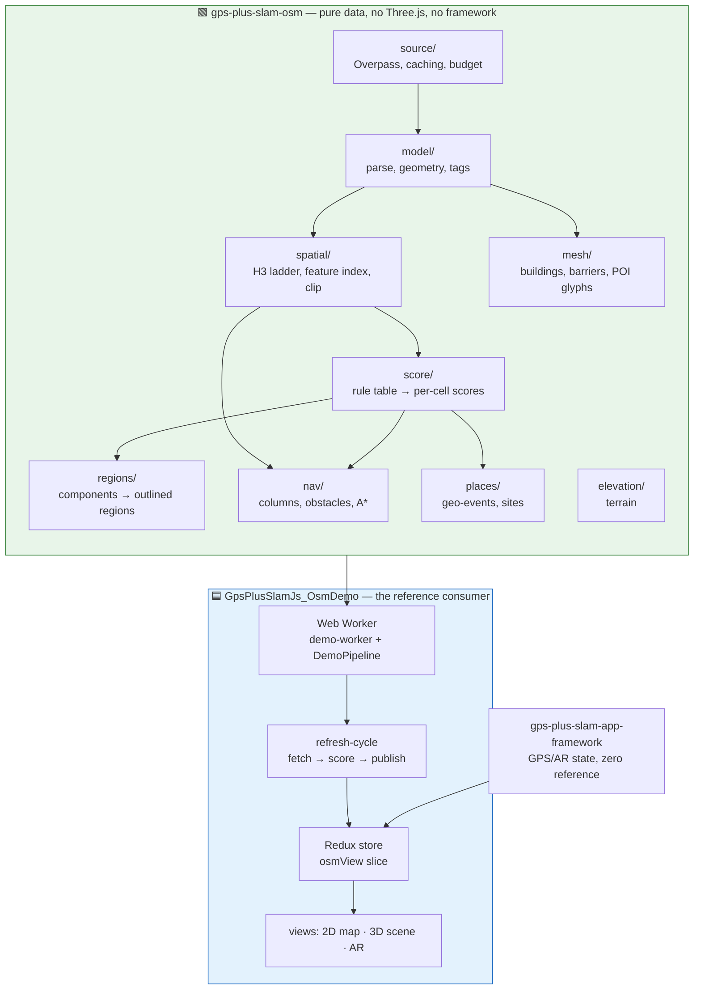
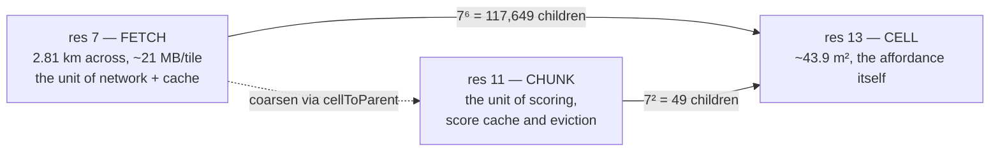
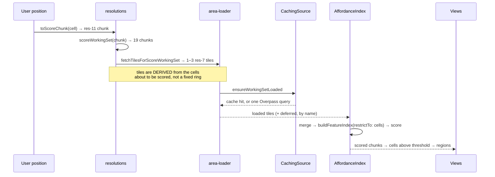
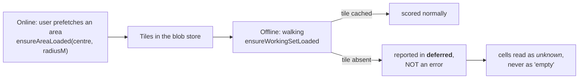
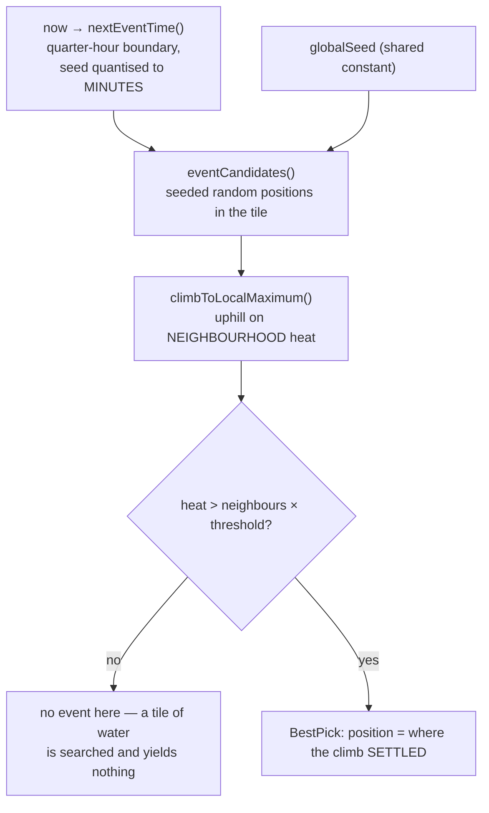

# The OSM affordance system — how it fits together

**Audience:** someone about to build on this package, and the LLM helping them.
It answers "what happens when, and why is it shaped like that" — the questions a
file-level doc cannot, because the answer spans six modules and two processes.

**It deliberately does not repeat the per-file docs.** Every module has a `*.md`
sidecar next to it carrying its invariants, its measured numbers and its rejected
alternatives; those are linked from here and are the authority. A fact restated
in two places is a fact that will disagree with itself.

**Scope marker used throughout:**

- 🟩 **package** — a guarantee of `gps-plus-slam-osm`. Depend on it.
- 🟦 **reference consumer** — how `GpsPlusSlamJs_OsmDemo` chooses to use it. A
  worked example, not an API promise. Your app may do it differently.

---

## 1. The scenario this exists for

A user walks outdoors in AR. As they move, OpenStreetMap data for the ground
around them downloads in the background, is scored into a per-cell "affordance"
map — walkable, restingArea, battleArea and so on — and is aggregated into
regions. NPCs navigate on a **mixture** of two signals: OSM geometry says where
you physically _can_ walk, and the scored cells say where it is _good_ to walk.
Timed geo-events appear at places two strangers can both find without their
devices ever talking to each other.

Everything after the initial download is designed to work **offline**, because
the user walks into the woods and loses signal. The limits of that are §6.

---

## 2. The shape of it

**The one dependency rule that matters:** the package depends on `h3-js` and
nothing else. Persistence, workers and rendering are _injected_ or done by the
consumer. That is what lets the whole data layer run in a unit test, in a worker,
or on a server, and it is why `OsmDataSource` and the blob store are interfaces
rather than implementations.

---

## 3. The resolution ladder — the decision everything else follows from

Three H3 resolutions, each doing one job. 🟩

Full detail: [`spatial/resolutions.ts.md`](./src/spatial/resolutions.ts.md).

Two consequences worth internalising before reading any other flow:

- **One fetch tile contains ~117,649 affordance cells, so scoring is never eager
  over a tile.** Everything is scoped to a working set around the user. Any
  design that "just scores the tile" is proposing ~10⁵ cells of work per move.
- **Never truncate an H3 id string to coarsen it.** H3 packs the resolution into
  the index's high bits, so slicing produces an invalid cell, not a parent. Use
  `cellToParent`. This has bitten this codebase before and is restated in the
  sidecar for that reason.

---

## 4. The movement loop — what one step actually costs

The user moves; a new res-11 chunk is entered; this runs. 🟩 for everything
inside the package, 🟦 for the ring schedule and the worker.

**Why the fetch set is derived rather than a fixed `gridDisk` ring.** A fixed
7-tile ring over-fetches ~150 MB in a tile's interior and is still only
_heuristically_ sufficient at a boundary. Deriving the tiles from the chunks
about to be scored bounds the result at **1–3 tiles** (interior 1, edge 2, vertex 3) and makes "every chunk we score has its data" a property that is asserted, at
every radius. It was not asserted at every radius once, and rings 3–4 were
silently scored against unfetched tiles — where an unfetched cell scores as the
identity and is indistinguishable on screen from "nothing is mapped here". See
[`resolutions.ts.md`](./src/spatial/resolutions.ts.md).

**Why `restrictTo` clips rather than filters.** Covering a feature costs time
proportional to _the feature's_ extent, and OSM contains features of continental
extent — one fixture is a single element holding the entire North Sea, whose res-13
coverage is on the order of 10¹⁰ cells. Filtering after covering is not slow, it
is non-terminating in practice. See
[`h3-feature-index.ts.md`](./src/spatial/h3-feature-index.ts.md).

🟦 **Progressive rings.** The demo scores radius 2, then 3, then 4, publishing a
usable answer after each. Two traps this creates for any consumer that copies it,
both learned the hard way: every publish sets `loading: idle`, so "is this
final?" must be asked of the snapshot's **radius**, never of the loading flag;
and the ring reach must match what was fetched. See
[`refresh-cycle.ts.md`](../GpsPlusSlamJs_OsmDemo/src/refresh-cycle.ts.md) 🟦.

---

## 5. State: what is truth, what is derived

This is the question most often got wrong when extending the system.

- **Raw OSM tiles** — in the blob store (OPFS / IndexedDB / memory) 🟩
  - **Not rebuildable.** This is the ground truth, and the only thing persisted.
- **Merged features, converted geometry, per-chunk scores** — in `AffordanceIndex` 🟩
  - Rebuildable from the tiles, and rebuilt per session by design.
- **The published snapshot** (cells, counts, regions) — in Redux 🟦
  - Rebuildable from the index.
- **Building and barrier meshes** — passed by callback, never Redux 🟦
  - Rebuildable; excluded from the store because `Float32Array` is not
    serialisable.

- **`AffordanceIndex` is the only class in the package that remembers anything.**
  Everything beneath it is a pure function. It owns invalidation: when a tile
  arrives late, `acceptTile` drops exactly the chunks that tile touches and says
  which. [`affordance-index.ts.md`](./src/score/affordance-index.ts.md)
- **The feature index is worker-cloneable but NOT JSON-serialisable** — it holds
  `Map`s. It is a derived, rebuildable artefact; the _tiles_ are what gets
  persisted. Pinned by a test, because the distinction is invisible until
  someone tries to `postMessage` it through the wrong channel.
- 🟦 **Redux holds only serialisable state, and the mesh is the exception that
  proves it.** Vertex data is `Float32Array`, which RTK rejects, so meshes travel
  by callback — and that callback fires _before_ the snapshot is dispatched,
  because the 3D view draws on the snapshot subscription and would otherwise
  render the new snapshot against the previous position's buildings.

---

## 6. Offline — what works, and where the edge is

🟩 The cache is **permanent and keyed by the H3 tile**, not by a query bbox. That
choice is what makes offline work at all: a walking user produces a slightly
different bbox on every request, so a bbox-keyed cache never hits.

The rules that make this honest:

- **`deferred` is not a failure.** It names tiles a rate limit or an absent
  network postponed. A caller that ignores it cannot distinguish "nothing is
  mapped here" from "not fetched yet". [`area-loader.ts.md`](./src/source/area-loader.ts.md)
- **`cellState(cell)` is tri-state** — `scored` / `empty` / `unknown` — precisely
  because two states made those two cases indistinguishable, and an unscored cell
  otherwise reads as the multiplicative identity, a plausible low number.
- **The edge of the world is real.** Walk beyond what was downloaded and the
  network is needed again. Nothing here pretends otherwise; the honest design
  choice was to make "nobody looked" visible rather than to fill it with a
  neutral value.
- 🟩 **Network budget is taken seriously** because the public Overpass API is
  donated infrastructure: one large tile per request rather than a seven-tile
  ring, cache-first, a local slot budget, single-in-flight per tile, backoff
  honouring `Retry-After`. See the README's "Network usage" section.

---

## 7. Navigation — geometry _and_ heat, which is the part people miss

An agent's route is not "walk on the walkable cells". Two signals combine: 🟩

- **OSM geometry says what is solid.** `nav/obstacles.ts` indexes barriers and
  buildings by cell, with heights, built from **lat/lng** rather than scene
  metres so that recentring the AR scene cannot invalidate the index.
- **The scored cells say what is preferable.** Cost and goal selection read the
  affordance scores.

The non-obvious part is the state space:

> An agent on top of a wall and an agent at its foot occupy **the same H3 cell**.

So a state is a **column** — `(cell, heightM)` — not a cell. Adjacency requires
both grid neighbourhood _and_ a climbable height step, which is what forces a
route _around_ a wall instead of through it. A 2D model cannot express this, and
an earlier version keyed its visited set by cell and therefore could not
represent the two states at once. [`column.ts.md`](./src/nav/column.ts.md) ·
[`obstacles.ts.md`](./src/nav/obstacles.ts.md) ·
[`search.ts.md`](./src/nav/search.ts.md)

`search.ts` is generic over the state type for that reason: the caller owns what
a state _is_ and how it is keyed.

⚠️ **A HILLSIDE IS NOT A WALL, and one threshold cannot say both.** The
climbable-step limit is calibrated against discontinuities — a kerb is 0.15 m, a
riser 0.18 m, a wall is metres — but the heights it compares are DEM samples at
cell centres **~6.4–6.9 m apart**. As a single absolute rule it therefore
declared any ground steeper than **~7.5 %** impassable, and a live session
reported a Cologne river promenade as unreachable in every downhill direction
while the `walkable` heat map rated it highly. Adjacency now asks two questions
and admits the step if **either** answers yes: the absolute change between two
surfaces against the step threshold, or — where the ground is known — the
**ground's grade** against `MAX_GROUND_GRADIENT` with the height above that
ground still against the step threshold. The first arm is the original rule
verbatim, so knowing the ground can only add edges **to the predicate** — a
bounded search built on it can still reach its expansion cap sooner, which is
why a refusal over a cliff is now slow rather than instant (measured: zero lost
routes across 1 200 corpus routes).
[`column.ts.md`](./src/nav/column.ts.md) ·
[`2026-08-18-0659-nav-terrain-slope-vs-step-plan.md`](./docs/2026-08-18-0659-nav-terrain-slope-vs-step-plan.md)

---

## 8. Geo-events — agreement without a server

Two players starting at opposite ends of the same area must arrive at the _same_
event, with no connection between their devices and no server. 🟩

What makes it work, and what surprises people:

- **Determinism is the feature.** Same seed + same quarter hour ⇒ same positions,
  on every device, forever. The seed is quantised to whole minutes because a
  clock a second out would otherwise compute a different place.
- **The climb compares the _neighbourhood's_ heat, not the cell's.** So the
  winner is often **not** the highest-scoring cell in view — being surrounded by
  good ground beats being a lone spike. This has been reported as a bug from a
  live session and is not one; it is the property that stops events landing on
  one lucky hexagon. Measured on the reported shape, the centre wins 11.96 to
  10.85.
- **Many candidates, few survivors.** Candidates that land on water or unmapped
  ground fail the gate. That is the intended funnel, not a defect.
- `tilesSearched` ≠ `picks.length`, deliberately: a tile that was searched and
  yielded nothing is different from a tile nobody loaded, and the UI needs to be
  able to say "you have less data loaded" rather than looking broken.

Full detail, including the `candidate` vs `position` distinction that has caused
two real defects: [`geo-event.ts.md`](./src/places/geo-event.ts.md).

---

## 9. Scores — the three rules that stop you misreading them

🟩 Cells are scored by a **pluggable rule table**: tag matches contribute factors
that multiply, starting from an identity of 1.

1. **Scores are unbounded.** There is no 0–1 range to compare against.
2. **They are NOT comparable across categories.** Threshold _per category_; never
   rank `walkable` against `battleArea`.
3. **A cell overlapped by five mapped features scores far above the identical
   physical ground with one feature mapped.** That is a data-completeness
   artefact of OSM, not a real signal about the place.

Regions are then connected components of above-threshold cells, with **exact**
outlines — the hex grid gives the boundary by construction, so the reference
implementation's concave-hull constant and its guesswork disappear, and a park
with a building in it gets the hole as a second ring for free.
[`connected-components.ts.md`](./src/regions/connected-components.ts.md) ·
[`region-builder.ts.md`](./src/regions/region-builder.ts.md)

⚠️ **Region ids identify a shape at a moment, not a place forever.** When two
regions merge as more data loads, both ids change. Never persist them as
long-lived keys.

---

## 10. Where to look next

- Building on the package: the README's "Using it" section is the end-to-end code
  path in ~30 lines.
- Changing scoring behaviour: `rules/` and `score/`, then re-read §9.
- Adding a consumer: read
  [`refresh-cycle.ts.md`](../GpsPlusSlamJs_OsmDemo/src/refresh-cycle.ts.md) 🟦 for
  the coalescing and failure-classification patterns before writing your own —
  both were arrived at by fixing real defects.
- Deeper design history lives in the maintainers' private planning docs; nothing
  in this document depends on them.
